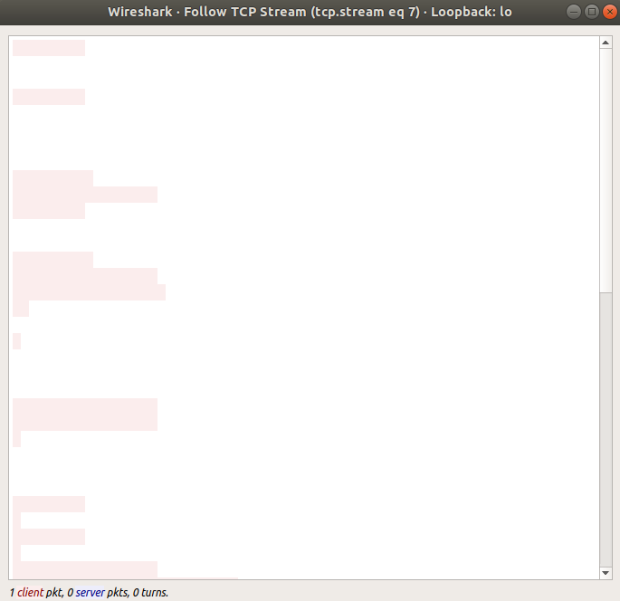

# Whitespacer

Whitespacer - a whitespace encoder/decoder

# What is it?

Whitespacer is an encoder and decoder that encodes bytes into whitespace characters. It reads from standard in, takes each of the four pairs of bits in each byte and encodes it as one of four whitespace characters:

- "\t"
- "\n"
- "\r"
- " " (space)

It then writes these whitespace characters to standard out.

Using a command line flag '-d' it performs the reverse, taking groups of four whitespace characeters and decoding them back into a single byte.

# How do I get and use it?

Clone down and compile. Only requires the C standard library:

```
git clone https://github.com/gregfoletta/whitespacer.git
cd whitespacer
make

echo "This is some example text" | ./ws | ./ws -d 
This is some example text
```

# Some Other Examples?

Here's hexdump a hexdump of the encoder's output. You can see the 8 input bytes become 32 output bytes.
```sh
echo -n 'One Two!' | ./ws | hexdump -C
00000000  20 20 09 0a 0d 20 0d 0a  0a 0a 0d 0a 09 09 0d 09  |  ... ..........|
00000010  09 0a 0a 0a 20 0a 20 0a  20 20 0d 0a 0a 09 0d 09  |.... . .  ......|
```

Here's an example of random bytes being pulled through the encoder and decoder, and confirmation the two files either side are the same.

```sh
# Create a file of random bytes
dd if=/dev/urandom of=urandom bs=1MB count=32

# Pull the file through the encoder/decoder
cat urandom | ./ws | ./ws -d > urandom.trans

# Are the files the same?
md5sum urandom*
5d0d602a93ae0a0ba1b53f8f391ae7fd  urandom
5d0d602a93ae0a0ba1b53f8f391ae7fd  urandom.trans
```

And here's what it looks like in Wireshark sending some encoded bytes through a TCP session:



# How Performant?

It's not too bad: on my Intel i7-8650U laptop, running over a file that's cached in memory and outputting to /dev/null, the encoding / decoding process runs at 258MiB/s.

# Seems Pointless?

I'm not sure there are many useful applications of this program. But it was a fun little project with a small scope.


